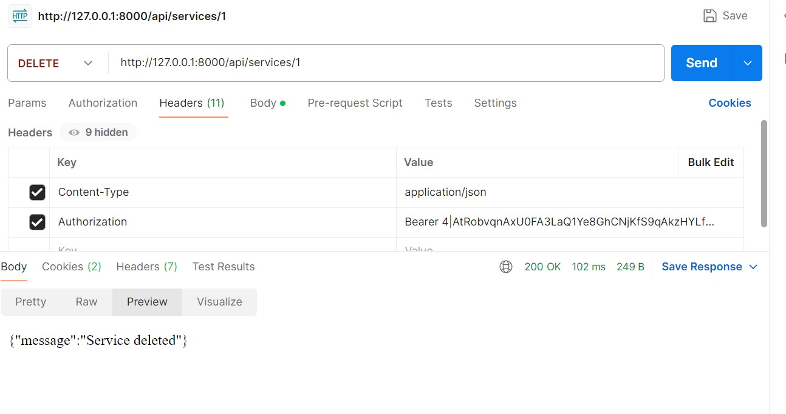

# Simple Service Booking System (Laravel 11)

## Project Overview
This project is a **Simple Service Booking System** built with Laravel 11 and Laravel Sanctum for API authentication.  
It allows customers to register, view available services, and book services. Admin users can manage services and view all bookings.  

This project is built following Laravel conventions, RESTful design, and includes FormRequest validation.

---

## Features

### 1. Authentication
- Customer registration & login via API (`/api/register`, `/api/login`)
- Admin login via API (credentials can be seeded)
- Token-based authentication using Laravel Sanctum

### 2. Models & Relationships
| Model    | Description |
|----------|-------------|
| User     | Represents both customers and admins (`role` column distinguishes them) |
| Service  | id, name, description, price, status (`active` or `inactive`) |
| Booking  | id, user_id, service_id, booking_date, status (`pending`, `completed`, etc.) |

Relationships:
- User has many Bookings
- Service has many Bookings
- Booking belongs to User and Service

### 3. API Endpoints

#### Public (No Auth)
| Method | Endpoint       | Description                  |
|--------|----------------|------------------------------|
| POST   | `/api/register` | Customer registration        |
| POST   | `/api/login`    | Customer/Admin login         |

#### Customer (Authenticated)
| Method | Endpoint           | Description                          |
|--------|------------------|--------------------------------------|
| GET    | `/api/services`   | List all active services             |
| POST   | `/api/bookings`   | Book a service                        |
| GET    | `/api/bookings`   | List logged-in user's bookings        |

#### Admin (Authenticated + AdminMiddleware)
| Method | Endpoint               | Description                          |
|--------|------------------------|--------------------------------------|
| POST   | `/api/services`        | Create a new service                 |
| PUT    | `/api/services/{id}`   | Update an existing service           |
| DELETE | `/api/services/{id}`   | Delete a service                     |
| GET    | `/api/admin/bookings`  | List all bookings                     |

---
## Postman Collection

A Postman collection is provided in the `docs/` folder:

- File: `docs/ServiceBookingSystem.postman_collection.json`
- Import it into Postman to test all API endpoints.
- Use the environment variables:
  - `{{base_url}}` → `http://127.0.0.1:8000`
  - `{{token}}` → Your Bearer token obtained from `/api/login`
- Test API requests in this order:
  1. Register or Login
  2. Copy Bearer token into `{{token}}`
  3. Test customer and admin routes

## Installation & Setup

1. **Clone the repository**
```bash
git clone https://github.com/<your-username>/<repo-name>.git
cd <repo-name>


### Project Screenshot
